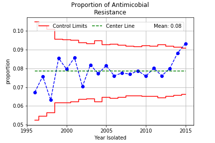

# ds-prep-capstone
### Data Science Prep Course: Capstone Data Analysis Report  
### Data Set: National Antimicrobial Resistance Monitoring System for Enteric Bacteria (NARMS)  
#### Introduction  
The World Health Organization has found increase in antimicrobial resistance in every region of the world. Antimicrobial resistance contributes to 23,000 deaths per year in the US and 25,000 deaths per year in the EU. High proportion of resistance is found in all world regions. Over use of antimicrobial drugs have led to the proliferation of resistant bacteria. The National Antimicrobial Resistance Monitoring System has been tracking the incidences of antimicrobial resistance since the mid 1990's. Analysis of the enteric bacteria dataset seems to show that the incidence of resistance is increasing starting from 2010. The data does not address the prevalence of resistance in the ecosystems, as specimens were only collected once a disease was observed. The database includes some information on the plasmid markers that express resistance, these sequences along with others known can be aligned to sequences in the American Gut Biome database to develop an understanding of the potential prevalence of resistance. 

In this chart the proportion of enteric bacteria resistant to one or more antimicrobials is plotted against the year isolated. On average, about 8% of enteric bacteria are resistance to some antimicrobial. Though the last three years there is indication that resistance is increasing, a short trend increasing and the last point is greater that 3 standard deviations from the mean.

#### Data Set 
Data set:  https://wwwn.cdc.gov/narmsnow/ 

#### References 
World Health Organization. Antimicrobial resistance: global report on surveillance. World Health Organization 2014 
Beceiro, A., Tomás, M., & Bou, G. (2013). Antimicrobial Resistance and Virulence: a Successful or Deleterious Association in the Bacterial World? Clinical Microbiology Reviews, 26(2), 185–230. http://doi.org/10.1128/CMR.00059-12

